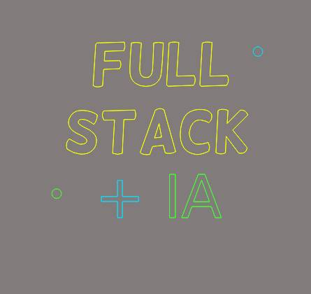

# :computer:PortifolioDev

  

  
   
  	 
   

  

   
   
   
   
  

O PortifolioDev é uma aplicação Full Stack que funciona como uma vitrine expondo todos osprojetos desenvolvidos pelo autor.
É uma aplicação que abrange tanto o desenvolvimento da interface do usuário (front-end) quanto a lógica do servidor e banco de dados (back-end) em uma única base de código.
Foi usado as ferramentas mais modernas de desenvolvimento.

## :computer: Como rodar o projeto:computer:
### Requisitos: 
- Node.js instalado
### Execução: 
- 1- git clone https://github.com/MariaMuniz2015/PortifolioDev
- 2- Acesse o diretório do projeto: cd portifolio
- 3- Acesse sua conta no Supabase ou crie uma nova conta.
- 4- Navegue até o projeto no Supabase e clique no botão connect.
- 5- Clique em selecionar ORM e selecione o ORM Prisma.
- 6- Copie as variáveis de ambiente listadas, crie um arquivo .env na pasta backend e preencha com as seguintes informações:
###### DATABASE_URL=
###### DIRECT_URL=
###### PORT=

###### Obs: Caso o valor da porta não seja adicionado, a aplicação rodará por padrão na porta 4000.
- 7- Crie uma conta no site no n8n, e importe o fluxo definido no arquivo assistente-pessoal que está na pasta assets.
- 8- Após importar o fluxo, clique no primeiro nó, acesse webhooks url, clique em Production URL e copie o valor dessa URL. Obs: Lembre-se de ativar o workflow no n8n.
- 9- Crie um arquivo .env na pasta web e preencha com as seguintes informações, sendo que a URL da API é a URL do backend e a segunda variável deve ter como valor a URL que extraimos no n8n:
###### NEXT_PUBLIC_API_URL=
###### NEXT_PUBLIC_CHAT_WEBHOOK=
- 10- Instale as dependências dos projetos web e backend com o comando npm i em cada uma das pastas.
- 11-Abra as pastas web e backend em dois terminais diferentes e rode o comando npm run dev em cada um dos terminais para executar o projeto.
  ## :smile: Features do projeto: :smile:
  - Exibição de Projetos
  - Integração com Agentes de IA via Chat
  - Repositórios GitHub Integrados.
  - Lista de tecnologias destacadas.
  - Repositórios GitHub Integrados.
  - Lista de tecnologias dos projetos.
  - Buscar os projetos por Id com as tecnologias associadas.

